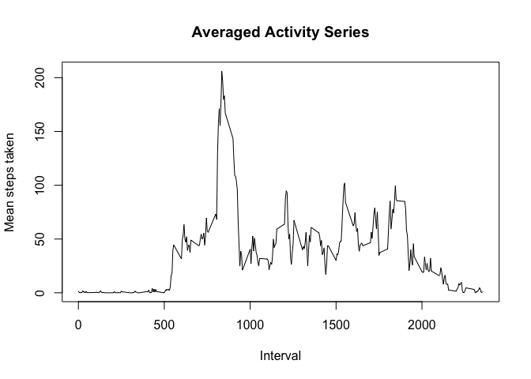

## Loading and preprocessing the data

We begin unzipping the data.

```r
zip_name <- 'activity.zip'
unzip(zip_name, exdir = "./")
```

Now that the `csv` file is available in the current directory, we proceed reading it, improving the format of the date column, and showing the reader its head.

```r
library(lubridate)
```

```
## 
## Attaching package: 'lubridate'
```

```
## The following objects are masked from 'package:base':
## 
##     date, intersect, setdiff, union
```

```r
df <- read.csv("activity.csv")
df$date <- ymd(df$date)
head(df)
```

```
##   steps       date interval
## 1    NA 2012-10-01        0
## 2    NA 2012-10-01        5
## 3    NA 2012-10-01       10
## 4    NA 2012-10-01       15
## 5    NA 2012-10-01       20
## 6    NA 2012-10-01       25
```

## What is mean total number of steps taken per day?

To summarise the data, we know proceed to make a histogram of the total number of steps taken each day. To do so, we aggregate the data by day excluding NA's.


```r
Steps <- aggregate(df$steps,by=list(df$date),sum, na.rm=TRUE)

hist(Steps$x, border = 'beige', main = 'Histogram of steps per day', 
     xlab = 'Total steps', ylab = 'Frequency',
     breaks = 20
     )
```

<!-- -->

Now, we calculate the mean and median of the total number of steps taken per day.

```r
data.frame('Statistics'=c( mean(Steps$x), median(Steps$x) ), 
           row.names = c('Mean','Median') ) 
```

```
##        Statistics
## Mean      9354.23
## Median   10395.00
```


## What is the average daily activity pattern?

We begin with a time series plot of the 5-minute interval (x-axis) and the average number of steps taken, averaged across all days (y-axis). Here it is important to remark that missing values are removed.

```r
mean_interval <- aggregate(df$steps, by=list(df$interval), mean, na.rm=TRUE)
with(mean_interval, plot(Group.1, x, type = 'l',
     xlab = 'Interval',ylab = 'Mean steps taken', main = 'Averaged Activity Series'))
```

<!-- -->

Let's check which 5-minute interval, on average across all the days in the dataset, contains the maximum number of steps. According to the plot, it has to be a value between $5:50$ AM and $10$ AM, which corresponds to a number between $9$ AM and $4$ PM. 


```r
mean_interval[mean_interval$x == max(mean_interval$x),]
```

```
##     Group.1        x
## 104     835 206.1698
```
This tells us that the interval with the highest activity, on average, is the one from $8:35$ AM to $8:40$ AM. Here, the subject of measurement took an average of $206.17$ steps.

## Imputing missing values

The presence of missing days may introduce bias into some calculations or summaries of the data; thus, here we will treat missing values.

We begin computing the number of missing values in the dataset (i.e. the total number of rows with NA's).

```r
sum(is.na(df))
```

```
## [1] 2304
```
Those are a lot of values, approximately 13.1147541% of the dataset. 

Now let's replace NA's. Here we will use the following strategy: We will replace each NA with the median of its corresponding 5-minute interval over all days. However, if the median is not available, we will use $1$ step as replacement.

```r
mi <- aggregate(df$steps, by=list(df$interval), median, na.rm=TRUE)
dg <- df
dg[is.na(dg$steps),'steps'] <- match(dg[is.na(dg$steps),"interval"],mi$x, nomatch = 1)
```

Similarly as before, we make a histogram of the total number of steps taken each day and calculate and report the mean and median total number of steps taken per day.

```r
Steps <- aggregate(dg$steps, by = list(df$date), sum)
hist(Steps$x, border = 'beige', main = 'Histogram of steps per day', 
     xlab = 'Total steps', ylab = 'Frequency',
     breaks = 20
     )
```

<!-- -->

```r
data.frame('Statistics' = c( mean(Steps$x), median(Steps$x) ), 
           row.names    = c('Mean','Median') ) 
```

```
##        Statistics
## Mean     9493.115
## Median  10395.000
```
We can clearly see a difference both in the reported histogram and in the statistics. The impact of imputing missing data on the estimates of the total daily number of steps is a higher mean and median, and an histogram that now has values in previously empty columns.

## Are there differences in activity patterns between weekdays and weekends?

To answer this question, we first add a new factor variable to the data indicating whether the date for each observation is a weekday or weekend.

```r
dg$day <- as.factor(weekdays(dg$date) %in% c("Saturday", "Sunday"))
levels(dg$day) <- c("weekday", "weekend")
summary(dg$day)
```

```
## weekday weekend 
##   12960    4608
```

Finally let's plot each type of day with respect to the interval data as we did before.

```r
library(ggplot2)

mean_day <- aggregate(dg$steps, by=list(dg$interval, dg$day), mean)

qplot(Group.1, x, data = mean_day, facets = .~Group.2, main = 'Aggregated Activity Series',
      geom = 'line', xlab = 'Interval', ylab = 'Number of steps')
```

<!-- -->

At last, it can be seen from the plot that the subject is more active on week days during the same time interval that we found earlier. 


